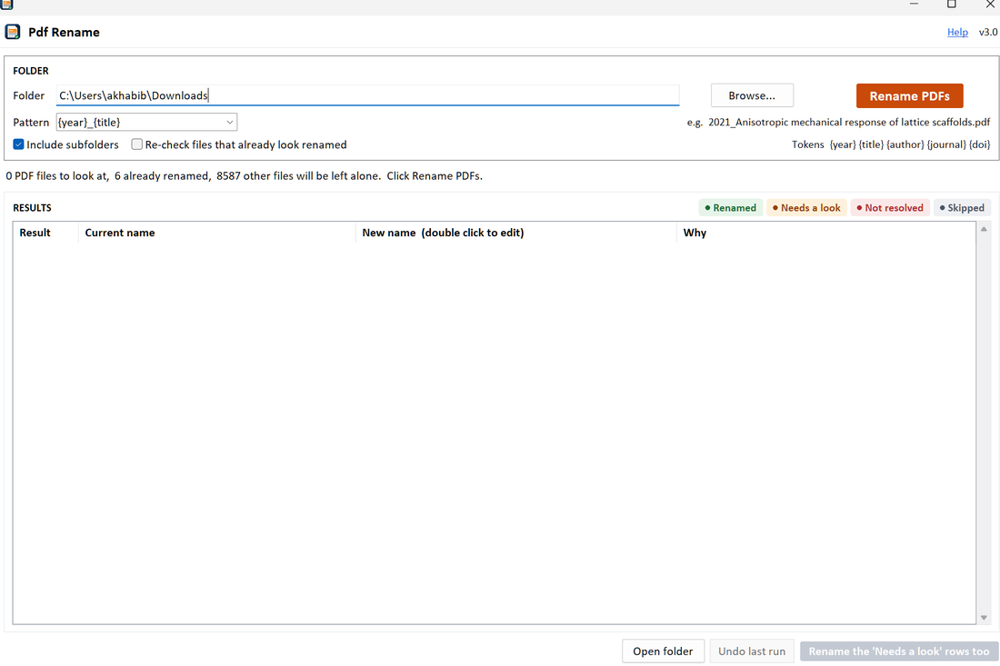
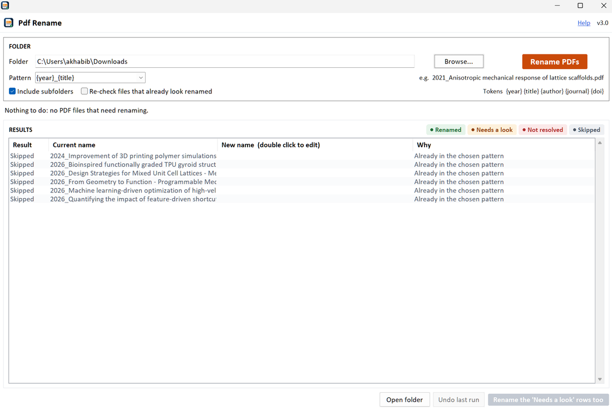

# Pdf Rename

Renames a folder of downloaded research papers to `YYYY_Title of the paper.pdf`, using the publisher's own record rather than the file's timestamp.




Downloaded papers arrive as `1-s2.0-S1751616121002708-main.pdf` or `download (3).pdf`. Months later they are unfindable. This renames them in one click, and refuses to guess: a file is renamed automatically only when the year and title are confirmed against the publisher record, and everything else is listed for you to approve.

---

## Install

**Windows, no Python needed.**

1. Download this repository: green **Code** button → **Download ZIP**, then unzip it anywhere.
2. Double click **`Pdf Rename.exe`**.

The first run sets itself up: it finds Python or installs it for your user account only (no administrator rights), adds the two libraries it needs, puts a desktop icon there, and opens the app. It takes a few minutes and needs an internet connection. Every run after that opens immediately.

Windows SmartScreen may warn the first time, because the launcher is not code-signed. Click **More info** → **Run anyway**. The launcher's full C source is in [`launcher/`](launcher/) if you want to read or rebuild it.

---

## Use

1. Double click the **Pdf Rename** desktop icon.
2. Paste a folder path, or click **Browse** and pick the folder.
3. Pick a name pattern, or type your own.
4. Click **Rename PDFs**.

Confirmed papers are renamed on the spot. The rest are listed with a proposed name and a reason.



| Result | Meaning |
| --- | --- |
| **Renamed** | Done. The year and title were confirmed against the publisher record. |
| **Needs a look** | A name was found but not confirmed. **Not applied.** Read the *Why* column, double click to edit the name, then press *Rename the 'Needs a look' rows too*. |
| **Not resolved** | Nothing found. Usually a scan with no text layer, or no DOI and an unusual title. Name it by hand. |
| **Skipped** | Already in the chosen pattern. |

Non PDF files are never touched. Subfolders are included only if you tick the box.

### Name patterns

Pick from the dropdown or type your own. `{year}` and `{title}` are required; `{author}`, `{journal}` and `{doi}` are optional. Your choice is remembered.

| Pattern | Produces |
| --- | --- |
| `{year}_{title}` | `2021_Anisotropic mechanical response of lattice scaffolds.pdf` |
| `{year}_{author}_{title}` | `2021_Lim et al_Anisotropic mechanical response…pdf` |
| `{author}_{year}_{title}` | `Lim et al_2021_Anisotropic mechanical response…pdf` |
| `{author} ({year}) {title}` | `Lim et al (2021) Anisotropic mechanical response…pdf` |

### Undo

Every run writes `_pdfrenamer_log_<timestamp>.csv` into the folder. **Undo last run** reads the newest log and puts every name back. Applying the *Needs a look* rows writes its own log, so one Undo reverses that step and a second Undo reverses the run before it.

---

## How it decides

The publication year cannot be read reliably from a PDF: the file's creation date is the date the file was made, and the text may carry several years. It comes from the publisher record, reached through the DOI printed in the paper.

```
PDF ──> text + metadata of the first 2 pages
          │
          ├─> every DOI on those pages, ranked by how often each appears
          │     (a paper prints its own DOI two or three times;
          │      a cited paper's DOI appears once)
          │
          └─> Crossref /works/{doi}  ──>  title, year, first author
                          │
                          ▼
              Do ≥60% of that title's words appear in the PDF text?
                    │                         │
                   yes                        no
                    │                         │
              CONFIRMED                 try a title search; confirmed only if
              renamed now               similarity ≥0.90 AND the first author's
                                        surname is in the text, else NEEDS A LOOK
```

Two safeguards matter:

- **The title check.** The first DOI on a page is sometimes a cited paper's, not the paper's own. Comparing the record Crossref returns against the text on the page is what stops a wrong record being accepted.
- **Failure is not absence.** A 429, a 5xx or a dropped connection is reported as *not resolved* and retried with backoff. It never falls through to the PDF's embedded metadata, because a wrong publication year written silently is worse than no rename.

---

## Settings

Crossref asks scripted users for a contact address and gives them a faster, more reliable pool. Set it once, either in `renamer_core.py`:

```python
CONTACT_EMAIL = "you@example.edu"
```

or in the settings file, where it survives updating the script:

```
%APPDATA%\PDFRenamer\settings.json
{ "contact_email": "you@example.edu" }
```

Until one is set, the status line after a run says so.

---

## Limitations

- **Windows only** in practice. The logic is cross platform, but the launcher, the desktop icon and the native folder dialog are Windows specific.
- **Scanned PDFs** with no text layer are never renamed. OCR is out of scope.
- **Crossref coverage.** Journal and conference DOIs are well covered. Theses, standards, reports and many preprints are not, and land in *Not resolved*.
- **Short generic titles** are hard to confirm by title search and will need a DOI in the text or a name by hand.
- Files open in another program cannot be renamed; close them and run again.

---

## Running from source

Clone the repository, or use the green **Code** button → **Download ZIP**, then:

```bash
cd pdf-rename
pip install -r requirements.txt
python pdf_renamer_app.py
```

Requires Python 3.9 or newer with tkinter (ticked as *tcl/tk and IDLE* in the python.org installer). The floor comes from pypdf, not from this code, which runs on 3.7.

### Tests

```bash
python tests/test_pdf_renamer.py
```

66 checks, no network and no real PDFs required: a fake Crossref and handmade PDFs cover name building, DOI ranking and trimming, the title check, every Crossref failure mode, chain and swap safe renaming, undo, cancel, subfolders and custom patterns. The window itself is smoke tested when a display is available.

### Layout

| Path | Purpose |
| --- | --- |
| `renamer_core.py` | All logic: reading PDFs, Crossref, the decision rule, renaming, undo. No GUI imports, so it is testable anywhere. |
| `pdf_renamer_app.py` | The tkinter window. Draws, runs the job on a worker thread, shows results. |
| `pdf_renamer_launcher.bat` | First run setup, then launches. Plain text, readable. |
| `Pdf Rename.exe` | 63 KB launcher that only carries the icon and starts the batch file. Source in `launcher/`. |
| `make_shortcut.ps1` | Creates the desktop and Start Menu shortcuts. |
| `tests/` | The check suite. |

Rebuild the launcher with MinGW:

```bash
x86_64-w64-mingw32-windres launcher/launcher.rc -O coff -o launcher.res
x86_64-w64-mingw32-gcc -municode -mwindows -O2 -s -o "Pdf Rename.exe" launcher/launcher.c launcher.res -lshell32
```

---

## Built with

[pypdf](https://github.com/py-pdf/pypdf) for reading PDFs, [requests](https://github.com/psf/requests) for HTTP, and the [Crossref REST API](https://api.crossref.org) for bibliographic records. Thanks to Crossref for keeping it open and free.

## License

MIT. See [LICENSE](LICENSE).
